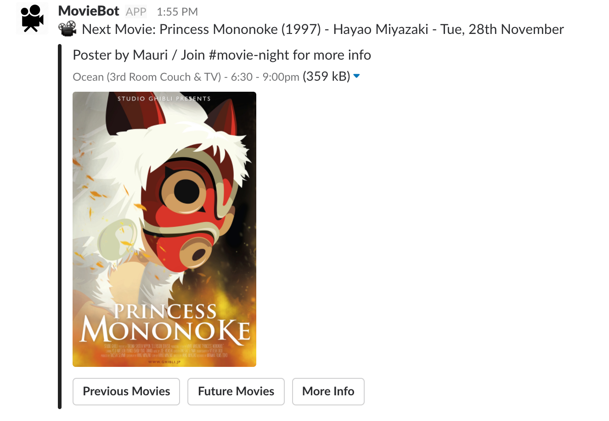
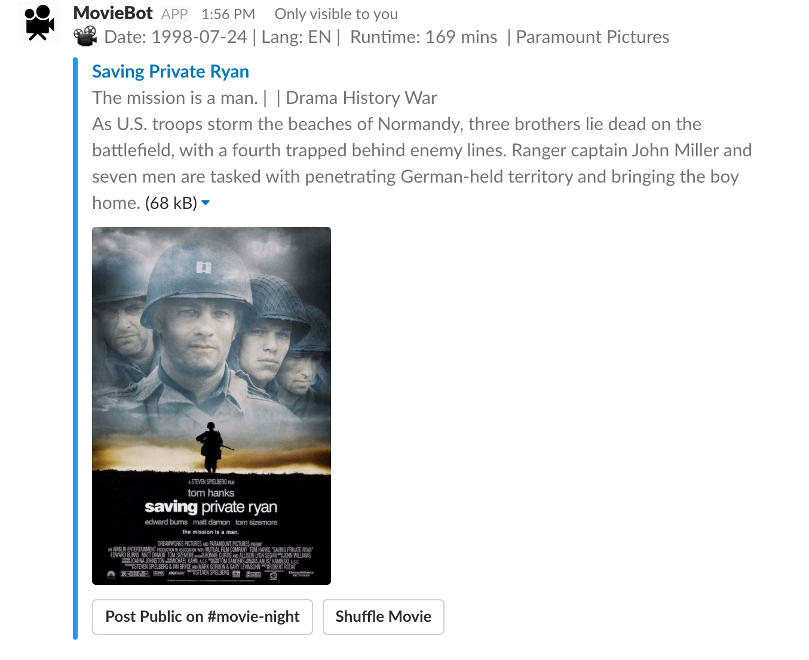
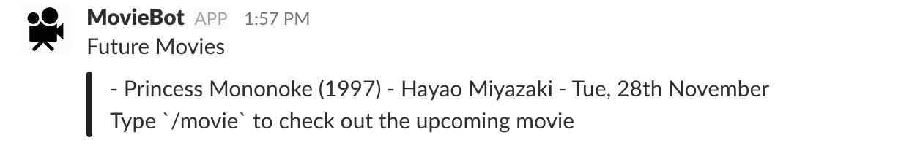
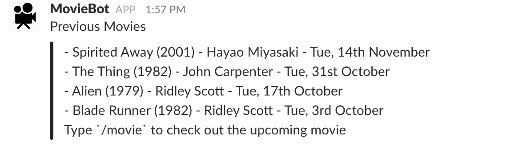
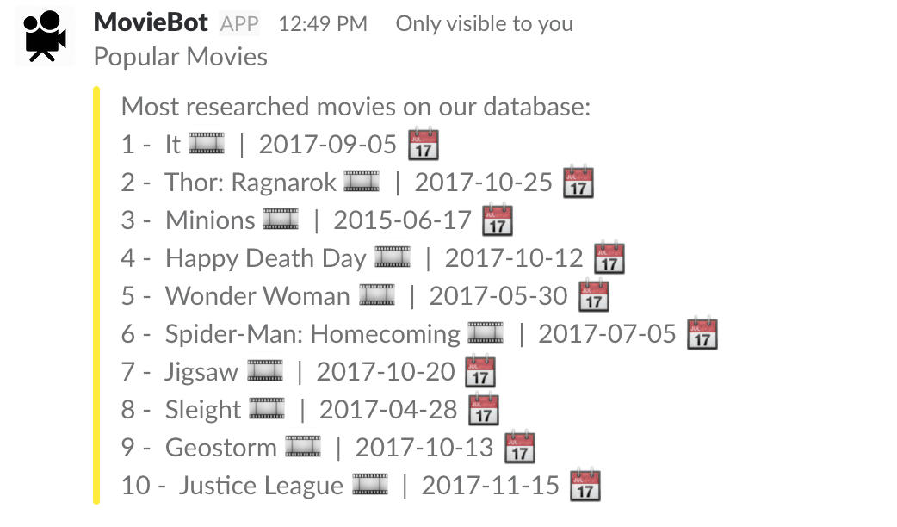

<h2>Slack Movie Bot</h2>


📽️ Get it [here](https://slack-movie-bot-jam3.herokuapp.com)

### Instructions


Possible Commands:
* `/movie` - Post the next movie on our calendar
    
    - Buttons to quickly access the other commands

<div align="center">

</div>

---

* `/movie search anything` - Search the API for the most popular movie under that name 
    
    - Click `Post Public` to post on #movie-night (needs to be manually setup on Slack)    
    - Ex: `/movie saving private ryan` 👇🏼 

<div align="center">

</div>

---

* `/movie future` - Post future movies list including the next one
<div align="center">

</div>

---

* `/movie previous` - Post past 10 movies in order
<div align="center">

</div>

---

* `/movie popular` - Post 10 most popular & searched movies
<div align="center">

</div>

---

To-Do Future
- [ ] Pull next movie poster from the API
- [x] Add `/movie popular` - show the 10 most popular movies
- [ ] Add a frontend to add designer posters and use that data for the `/movie` poster => requires node uploader
- [ ] Pull the movie name from a calendar => requires workaround with the Google Calendar API and Auth Config

---
### To contribute to this repo or do something similar

I recommend following the [Slack Docs](https://api.slack.com/) which is top notch and getting your own API Key from [The Movie DB](https://www.themoviedb.org/) and generate your own access keys from Slack

These links are useful:
- [The Movie DB Docs](https://www.themoviedb.org/documentation/api)
- [Creating Slack Command](https://tutorials.botsfloor.com/creating-a-slack-command-bot-from-scratch-with-node-js-distribute-it-25cf81f51040)
- [Basic Messaging (Slack)](https://api.slack.com/docs/messages)
- Others
    - [Google Calendar API](https://developers.google.com/google-apps/calendar/)
    - [Google Calendar Node Quickstart](https://developers.google.com/google-apps/calendar/quickstart/nodejs)

* First configure Slack
```bash
git clone <repo>
cd <folder>
npm install
nodemon index or node index
```
* Heroku
```
git commit <changes>
git push
git push heroku master
```
* Check Heroku Logs
```bash
heroku logs --tail
```